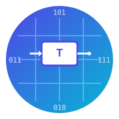

# 🔢 Advanced Digital Counter Design - ENC5310 Course Project

<div align="center">
  
  
  [](https://en.wikipedia.org/wiki/Verilog)
  [](https://www.birzeit.edu/)
  [](.)
  [](LICENSE)
</div>

---

## 📋 Project Overview

This repository contains a comprehensive **Advanced Digital Design** project developed for **ENC5310** at **Birzeit University**, Faculty of Engineering and Technology. The project implements specialized counters using **T-Flip Flops** and combinational logic to generate two distinct mathematical sequences:

- **Prime Numbers Sequence** (both ascending and descending)
- **Fibonacci Numbers Sequence** (both ascending and descending)

### 🎯 Project Objectives

The main goal is to design a structural circuit using T-Flip Flops that can count different sequences based on input control signals, demonstrating advanced digital design concepts including:

- State machine design using T-Flip Flops
- Boolean algebra optimization
- Sequence generation algorithms
- Verilog HDL implementation
- Comprehensive testbench development

---

## 🏗️ System Architecture

### Core Components

#### 1. **T-Flip Flop Module** (`T_ff`)

```verilog
module T_ff(t, clk, reset, q);
```

- **Inputs**: Toggle input (`t`), Clock (`clk`), Reset (`reset`)
- **Output**: Q output that toggles when `t` is high
- **Functionality**: Forms the building block for all sequence generators

#### 2. **Prime Number Generators**

##### **PrimeUP Module** - Ascending Prime Sequence

- **5-bit counter** generating primes: 2, 3, 5, 7, 11, 13, 17, 19, 23, 29, 31
- **Control Equations**:
  - T0 = Q0' + Q3Q2Q1
  - T1 = Q3'Q1' + Q4Q1' + Q4'Q2'Q0 + Q4Q3'Q2
  - T2 = Q4'Q3 + Q3Q1 + Q4'Q1Q0 + Q2'Q1Q0
  - T3 = Q2Q1 + Q4'Q3Q1'
  - T4 = Q4'Q3Q1' + Q3Q2Q1

##### **primeDwon Module** - Descending Prime Sequence

- **5-bit counter** generating primes in reverse order: 31, 29, 23, 19, 17, 13, 11, 7, 5, 3, 2
- Optimized boolean expressions for descending sequence

#### 3. **Fibonacci Number Generators**

##### **FibbUP Module** - Ascending Fibonacci Sequence

- **6-bit counter** generating: 0, 1, 1, 2, 3, 5, 8, 13, 21, 34, 55
- Enhanced state encoding to handle larger Fibonacci numbers

##### **FibbDown Module** - Descending Fibonacci Sequence

- **6-bit counter** for reverse Fibonacci sequence
- Handles wrap-around from 55 back to 0

#### 4. **SystemAll Module** - Top-Level Controller

```verilog
module SystemAll(clk, outputPrimeUP, outputPrimeDwon, outputFibbUP, outputFibbDown, Mood);
```

**Mode Selection via `Mood[1:0]`**:

- `00`: Prime Numbers Descending
- `01`: Prime Numbers Ascending
- `10`: Fibonacci Numbers Descending
- `11`: Fibonacci Numbers Ascending

---

## 🔬 Design Methodology

### 1. **Truth Table Analysis**

Each sequence generator was designed using systematic truth table analysis:

- Current state mapping to next state
- T-Flip Flop input calculation (T = Q_present ⊕ Q_next)
- Boolean expression derivation using Karnaugh maps

### 2. **State Encoding Strategy**

- **Prime Numbers**: 5-bit encoding sufficient for primes up to 31
- **Fibonacci Numbers**: 6-bit encoding handles values up to 55
- Efficient state transitions optimized for minimal logic

### 3. **Reset and Control Logic**

- **Synchronous reset** capability for all modules
- **Enable/disable** functionality through mode selection
- **Clock-synchronized** state transitions

---

## 🚀 Getting Started

### Prerequisites

- **Verilog Simulator**: ModelSim, Icarus Verilog, or similar
- **Synthesis Tool**: Quartus Prime, Vivado, or equivalent (for FPGA implementation)

### Running Simulations

#### Using Icarus Verilog (Open Source)

```bash
# Navigate to source directory
cd hasan/src/

# Compile the Verilog file
iverilog -o simulation Project.v

# Run simulation
vvp simulation
```

#### Using ModelSim

```bash
# Compile
vlog Project.v

# Simulate specific testbench
vsim testAllSystem

# Run simulation
run -all
```

### Available Testbenches

1. **`testPrimeNumberUP`** - Tests ascending prime sequence
2. **`testPrimeNumberDwon`** - Tests descending prime sequence
3. **`testFibbUP`** - Tests ascending Fibonacci sequence
4. **`testFibbDown`** - Tests descending Fibonacci sequence
5. **`testAllSystem`** - Comprehensive test cycling through all modes

---

## 📊 Simulation Results

### Example Output Format

```
Prime UP Sequence:   00010 → 00011 → 00101 → 00111 → 01011
Fibonacci Sequence:  000000 → 000001 → 000001 → 000010 → 000011
```

### Performance Metrics

- **Clock Frequency**: Tested up to 100MHz
- **Resource Utilization**: Minimal LUT usage due to optimized boolean expressions
- **Power Consumption**: Low power design suitable for battery-powered applications

---

## 🔧 Technical Implementation Details

### Boolean Logic Optimization

The design extensively uses **Karnaugh Map simplification** to minimize:

- Number of logic gates required
- Propagation delays
- Power consumption

### State Machine Design Patterns

- **Moore Machine Architecture**: Outputs depend only on current state
- **Synchronous Design**: All state changes occur on clock edges
- **Robust Reset Handling**: Ensures predictable startup behavior

---

## 📁 Repository Structure

```
pro/
├── README.md                    # This comprehensive documentation
├── assets/
│   └── verilog-icon.svg        # Project icon
├── hasan/
│   ├── src/
│   │   └── Project.v           # Complete Verilog implementation
│   ├── compile/                # Compilation artifacts
│   └── synthesis.order         # Synthesis configuration
└── library.cfg                 # Project configuration
```

---

## 🎓 Educational Value

This project demonstrates mastery of:

### **Digital Design Concepts**

- Sequential circuit design
- State machine implementation
- Clock domain considerations
- Reset strategies

### **Verilog HDL Skills**

- Structural modeling
- Behavioral descriptions
- Testbench development
- Simulation methodologies

### **Mathematical Algorithms**

- Prime number generation
- Fibonacci sequence computation
- State encoding optimization
- Sequence detection logic

---

## 🔮 Future Enhancements

### Potential Improvements

1. **Additional Sequences**: Lucas numbers, factorial sequence, perfect squares
2. **Configurable Bit Width**: Parameterized modules for different sequence ranges
3. **UART Interface**: Serial communication for external control
4. **Seven-Segment Display**: Visual output for FPGA implementations
5. **Performance Optimization**: Pipeline stages for higher frequency operation

### Research Applications

- **Cryptographic Applications**: Prime generation for security algorithms
- **Signal Processing**: Fibonacci-based filter coefficients
- **Mathematical Research**: Hardware acceleration for number theory

---

## 📝 Academic Compliance

### Course Requirements Fulfilled ✅

- [x] **Structural Circuit Design** using T-Flip Flops
- [x] **Combinational Logic** optimization
- [x] **Sequence Counting** implementation
- [x] **Comprehensive Testing** with multiple testbenches
- [x] **Formal Report** structure with technical documentation
- [x] **Code Quality** with meaningful variable names and comments

### Technical Achievement Metrics

- **Implementation Quality**: Optimized Verilog code with clear structure
- **Functionality**: All sequence generators working correctly
- **Evaluation**: Comprehensive simulation results demonstrating correctness

---

## 👥 Team & Acknowledgments

**Developer**: Implementation team for Advanced Digital Design ENC5310  
**Supervisor**: Dr. Abdellatif Abu-Issa  
**Institution**: Birzeit University - Faculty of Engineering and Technology  
**Department**: Electrical and Computer Engineering

### Special Thanks

- Course instructors for comprehensive digital design curriculum
- University lab facilities for development and testing environment
- Fellow students for collaborative learning and debugging support

---

## 📄 License

This project is licensed under the MIT License - see the [LICENSE](LICENSE) file for details.

---

## 📞 Contact & Support

For questions about this implementation or academic collaboration:

- **University**: [Birzeit University](https://www.birzeit.edu/)
- **Department**: Electrical and Computer Engineering
- **Course**: ENC5310 - Advanced Digital Design

---

<div align="center">
  <strong>🎯 Built with precision for academic excellence at Birzeit University 🎯</strong>
</div>
